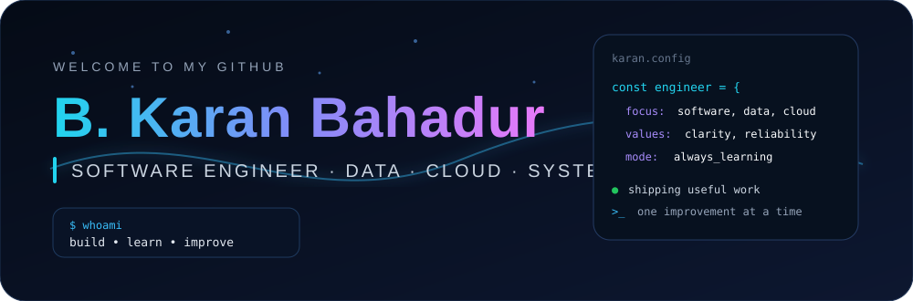

 

  

---

## ✦ ABOUT ME

I build practical software with an emphasis on **clarity, reliability and maintainability**. My interests sit at the intersection of application development, data systems, cloud infrastructure and automation.

> **Principles:** simple designs · readable code · strong fundamentals · continuous improvement

### Current Focus

`DSA` · `SQL` · `Data Engineering` · `Cloud` · `DevOps` · `AI/ML`

---

## ⚡ ENGINEERING STACK

### Languages

   

### Web & Data

   

### Cloud & Infrastructure

    

### Development

 

---

## 🚀 SELECTED WORK

**study** — a structured CSE knowledge repository covering programming, DSA, DBMS, operating systems, networks, AI/ML, cloud, security, SQL and DevOps.

---

## 📊 GITHUB ACTIVITY

  

---

## 🌌 CONTRIBUTION HISTORY

---

## 🏆 RECOGNITION

---

## 🔗 CONNECT

  

Build deliberately · Keep learning · Leave the code better than you found it.

  

