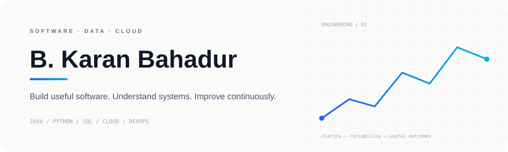

<picture>
  <source media="(prefers-color-scheme: dark)" srcset="./profile-card-dark.svg">
  <source media="(prefers-color-scheme: light)" srcset="./profile-card-light.svg">
  
</picture>

  

 

  

---

## ABOUT

I build software by starting with the problem, understanding the system, and improving the implementation through iteration.

My interests are **software engineering, data systems, cloud infrastructure and automation**.

> **Working software first. Better software next.**

---

## TOOLKIT

  

`JAVA` · `PYTHON` · `C` · `SQL` · `MYSQL` · `AWS` · `AZURE` · `GCP` · `GIT` · `DOCKER` · `TERRAFORM`

---

## FEATURED WORK

### `study.`

**CSE knowledge, organised as an engineering reference.**

Programming · DSA · DBMS · Operating Systems · Networks · AI/ML · Cloud · Security · SQL · DevOps

---

## NOW

<!--START_SECTION:now-->

**Current GitHub snapshot**

Loading the latest activity…

<!--END_SECTION:now-->

---

## GITHUB SIGNALS

  

---

## CONTRIBUTION ACTIVITY

---

## TROPHIES

---

## DIRECTION

**BUILD** — practical software  
**EXPLORE** — data & cloud systems  
**STRENGTHEN** — algorithms & engineering fundamentals

---

### `> let's build something useful.`

  

write less · understand more · ship better

