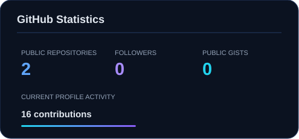
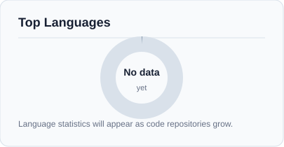

# B. KARAN BAHADUR

 

---

## About

I build software with an emphasis on **clarity, reliability and maintainability**. My interests span application development, data systems, cloud infrastructure and automation.

I prefer simple designs, readable code and practical solutions—and I improve by building, testing and refining.

**Current focus:** `DSA` · `SQL` · `Data Engineering` · `Cloud` · `DevOps` · `AI/ML`

---

## Engineering Stack

**Languages**

   

**Web & Data**

   

**Cloud & Infrastructure**

    

**Development**

 

---

## Selected Work

**study** is a structured CSE knowledge repository covering programming, DSA, DBMS, operating systems, networks, AI/ML, cloud, security, SQL and DevOps.

---

## GitHub Statistics

  

---

## Contribution Activity

---

## GitHub Recognition

---

## Connect

  

Build deliberately. Keep learning. Leave the code better than you found it.

 

