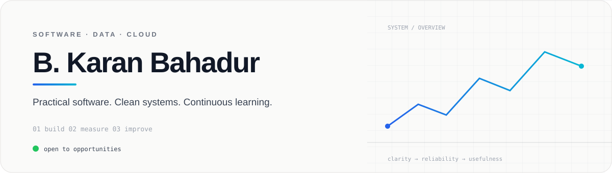

 

  

  

---

## ABOUT

I build software with an emphasis on **clarity, reliability and maintainability**.

My interests sit where **application development, data systems, cloud infrastructure and automation** meet. I value readable code, sensible architecture and solutions that are useful outside the demo.

`JAVA` · `PYTHON` · `SQL` · `DATA` · `CLOUD` · `DEVOPS`

---

## ENGINEERING STACK

 

 

---

## SELECTED WORK

<table width="100%">
<tr>
<td width="68%" valign="top">

### `study.`

A structured CSE knowledge repository covering programming, DSA, DBMS, operating systems, networks, AI/ML, cloud, security, SQL and DevOps.

</td>
<td width="32%" align="center" valign="middle">

  

</td>
</tr>
</table>

---

## GITHUB SNAPSHOT

  

> **Note:** I intentionally use live GitHub/Shield metrics here instead of fabricated statistics or fragile third-party charts. The numbers therefore remain tied to the actual account.

---

## CONTRIBUTION ACTIVITY

---

## RECOGNITION

---

## CONNECT

  

Build deliberately. Keep learning. Leave the code better than you found it.

 

